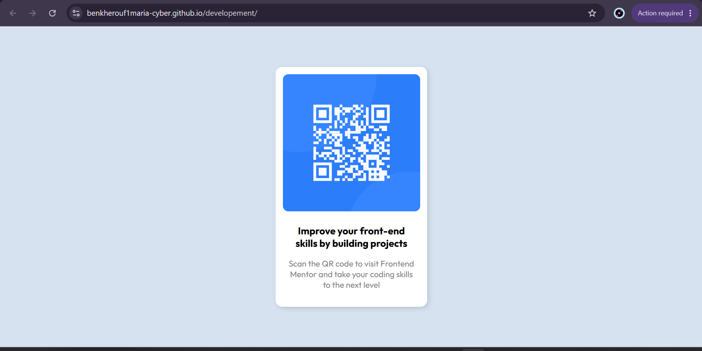

# Frontend Mentor - QR code component solution

## Table of contents

- [Overview](#overview)
  - [proof](#proof)
  - [links](#links)
  
- [My process](#my-process)
  - [struggles](#struggles)
  - [What I learned](#what-i-learned)
  - [Continued development](#continued-development)
  - [Useful resources](#useful-resources)
- [Author](#author)


## Overview

- Here is a guide to my journey with solving the "qr code design" which i completed the design is almost identical to the provided design by front-end mentor and is responsive to different screen sizes .


### proof

- screenshot : 

### Links

- Solution URL: [https://github.com/benkherouf1maria-cyber/developement](https://github.com/benkherouf1maria-cyber/developement)
- Live Site URL: [https://benkherouf1maria-cyber.github.io/developement/](https://benkherouf1maria-cyber.github.io/developement/)

## My process

### struggles

- with the positioning of the qr code component
- positioning of the elements inside the qr code
- figuring Flexbox with direction set as a column rather than a row
- adjusting the width of the image and the whole qr code component 

### Built with

- Semantic HTML5 markup
- CSS custom properties


### What I learned

- i learned how to center a div element ,i surrounded it with a container div in index.html
```html
  <div class="container">
    <div class="QR">
     
     <h1>Improve your front-end skills by building projects</h1>
     <p>scan the QR code to visit frontend mentor and take your coding skills to the next level</p>
    </div>
  </div>
```
 then in style.css 
```css
.container {
    display: flex;
    justify-content: center; /* horizontal */
    align-items: center;     /* vertical */
    height: 100vh;
}
```
- I also learned to set a max width to elements like in this project the image and the qr code component to allow them to shrink in small screens however i figured that makes them always take the smallest possible width so i also set the width of the qr code component to 40% of its container which is a div so a block level element
```css
.QR{   
    max-width:270px;   
    width:40%;
    display: flex;
    flex-direction: column;
    align-items: center;
    box-shadow: rgba(0, 0, 0, 0.139) 3px 3px 9px ;
       
}
.QR-img{
    display: flex;
    justify-content: center; /* horizontal */
    align-items: center;
    width: 100%;
    padding: 10px 10px 0px;
}
.QR-img img{
    
    width: 100%;
    max-width: 250px;
    height:auto;
    border-radius: 10px;
    margin:0px;
   
}
```
- with the flex display i learned that if the flex-direction is set to column one should use "align-items" to put the elements in the center of their container box
```css
.QR{   
    .........
    display: flex;
    flex-direction: column;
    align-items: center;
    .........       
}
``` 


### Continued development

i guess that would be the flex concept also the sizing of an element for diffrent screen sizes
### Useful resources

- [a ytb tutorial of html/css](https://www.youtube.com/watch?v=HGTJBPNC-Gw) - This helped me in css also to understand why i did this and that on a deeper level

## Author

- Website - [BENKHEROUF MARIA](https://www.your-site.com)
- Frontend Mentor - [@benkherouf1maria-cyber](https://www.frontendmentor.io/profile/benkherouf1maria-cyber)


